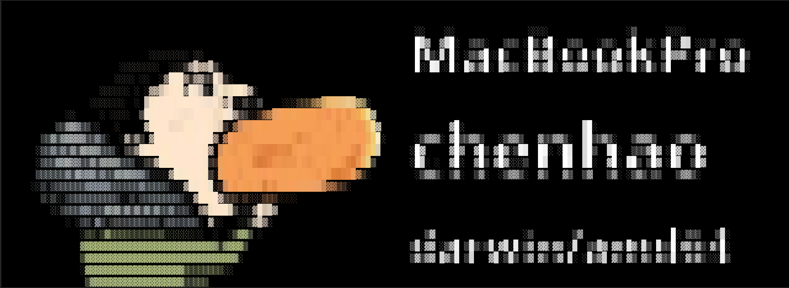
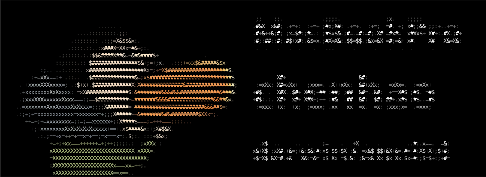

# Image Fetch

Image Fetch is a personal programming excise which tries to copy the  **[neofetch](https://github.com/dylanaraps/neofetch)**.

The major difference are:

-  The Image Fetch try to transform an image file to text file with color. 
-  The Image Fetch only print very simple system information - `hostname` `username` and `OS type`

Feel free use all of source. 

To use this you need to compile it by yourself, it's quite easy

```
make vget && make
```

After compile it successfully, you can simply run the following command:

```
build/bin/imgfetch  build/data/wsc.png
```

The output is something like below: (it uses the famous MEME in China recently, **I hope it can bring your server or laptop much more performance and reliability** )


another style  `build/bin/imgfetch  -d 1 build/data/wsc.png`




another style  `build/bin/imgfetch  -d 2 build/data/wsc.png`




if you like it. free feel raise the pull request to make more fun...


